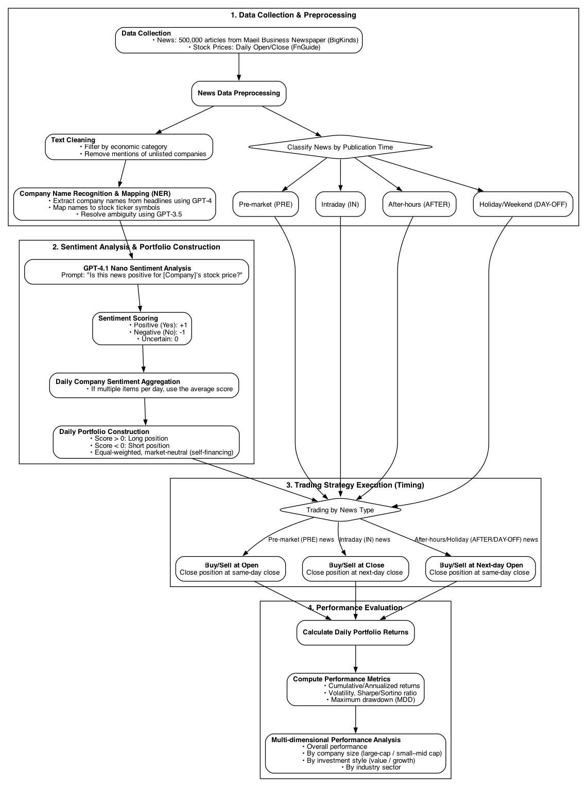

# Can ChatGPT Forecast Returns in the Korean Stock Market?

### Multi-Dimensional Evidence from News-Based Long-Short Strategies

**Sungwoo Park¹, Donghyun Lim², Hyoung-Goo Kang³**  
¹ AI Research Center, Shinhan Bank; Ph.D. Candidate, Hanyang University  
² Undergraduate Student, Department of Computer Science, Hanyang University  
³ Professor, Department of Finance and Computational Engineering, Hanyang University  
_(Corresponding Author)_  
**Date:** July 9, 2025

---

## Conference Submission

This paper has been submitted to the **Korean Finance Engineering Society (KAFE)** and the **Asia-Pacific Association of Derivatives (APAF) Conference**.  
For more information: [KAFE Conference 2025 Reference Page](https://www.kafe2023.org/bbs/reference/254)

---

## Abstract

This study evaluates the predictive power of GPT-4.1 Nano–based news sentiment analysis in the Korean stock market. Using ~500,000 news articles (Maeil Business Newspaper, 2022–Mar 2025) and FnGuide daily stock data, we test a long-short strategy segmented by news timing, firm size, investment style, and sector.

- **Key Findings:**
  - Long positions: stable cumulative returns.
  - Short positions: higher alpha, especially in large-cap and growth stocks.
  - Sector-level divergence: strong performance in chemicals, insurance, and construction.

**Implication:** GPT-based sentiment can be effective if combined with strategic filtering and position management.

---

## 1. Introduction

- Investor sentiment significantly influences stock prices (Tetlock, 2007; Barberis et al., 1998).
- Large Language Models (LLMs), especially GPT, outperform traditional sentiment dictionaries.
- U.S. studies (Lopez-Lira & Tang, 2023) show large gains from GPT-based sentiment long-short portfolios.
- Korean market has structural differences: language, retail participation, short-selling restrictions.
- **Goal:** Apply GPT sentiment classification to Korean financial news, test across size/style/sector.

---

## 2. Related Literature

- Early research: sentiment dictionaries → limited context understanding.
- Deep learning & transformers improved financial text analysis.
- GPT models capture nuanced sentiment, outperform FinBERT in some cases.
- Korean market: KNFSI & KR-FinBERT used, but GPT-based firm-level studies are rare.

---

## 3. Data & Methodology

- **Data:**
  - News: Maeil Business Newspaper (BigKinds) – ~500K headlines, Jan 2022–Mar 2025.
  - Stock: FnGuide daily open/close prices, KOSPI & KOSDAQ.
- **Preprocessing:**
  - Extract exact publish times via URL crawling.
  - Classify into PRE, IN, AFTER, DAY-OFF.
  - Keep “Economy” category only; remove non-listed entities.
  - GPT-4 NER for ticker mapping, GPT-3.5 Turbo for ambiguous cases.
- **Sentiment Analysis:**
  - Model: GPT-4.1 Nano, Korean input, prompt asks impact on stock price.
  - Output mapped to: Yes=+1, No=-1, Uncertain=0.
- **Strategy Construction:**
  - Daily rebalanced, self-financing long-short portfolios.
  - Entry/exit rules depend on news timing.
  - Performance metrics: return, volatility, Sharpe, Sortino, max drawdown.

---

## 4. Empirical Results

### 4.1 Overall Performance

- **Cumulative return:** 11.91% (Sharpe 0.38) vs KOSPI -14.43%.
- Short-only outperformed long-only.
- Negative news had stronger predictive impact.

### 4.2 By Firm Size

- **Large-cap:** 26.13% (Sharpe 0.75), alpha mainly from short positions.
- **SMID-cap:** 7.85% (Sharpe 0.22), higher volatility, weaker predictability.

### 4.3 By Investment Style

- **Value:** 23.03% (Sharpe 0.74), profits mostly from shorting (-ve news).
- **Growth:** 58.28% (Sharpe 1.17), both long and short profitable.

### 4.4 By Sector

- 12/26 sectors positive. Best sectors:
  - Chemicals: +106.74% (short-driven)
  - Insurance: +62.34% (long-driven)
  - Construction: +58.05% (short-driven)
- Weak sectors: Machinery & Equipment, Utilities, Commercial Services.

---

## 5. Conclusion

- GPT-based sentiment strategies can generate alpha in Korea.
- Strongest in large-cap, growth stocks, and certain sectors.
- Customization by firm type/industry is critical.

**Limitations:** No transaction costs, headline-only data, no Korean-finance fine-tuning.

---

## Research Pipeline

Below is the research pipeline used in the study:

---

## References

_(Abbreviated)_

- Tetlock, P. C. (2007). _Journal of Finance_.
- Lopez-Lira, A., & Tang, Y. (2023). SSRN Working Paper.
- Devlin, J., et al. (2019). _BERT_.
- Lee, J., & Kwon, T. (2025). _Korean Data Analysis Journal_.
